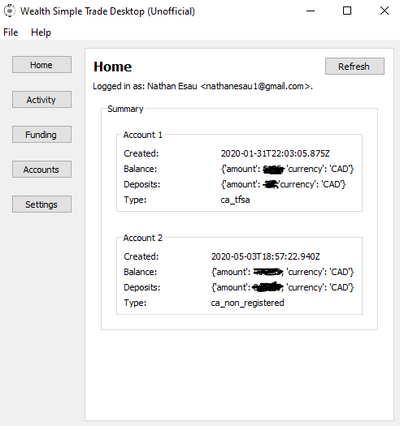

# wstradepyapp
Unofficial Desktop App For Wealth Simple Trade

## Background

Currently, WealthSimple Trade only has a mobile app. This projects aims to create an (unofficial) Desktop App to allow WealthSimple Trade to be used on Windows and Linux platforms.

## API documentation

Unoffical API documentation can be found here:

https://github.com/MarkGalloway/wealthsimple-trade/

## Software Used

* Python 3
* PyQt5 https://pypi.org/project/PyQt5/
* requests https://pypi.org/project/requests/

## Contributing 

Most of the work will be to test out API calls. Please add tests for new API functionality to ``tests/test_api.py``.

## Screenshots

App development is currently a work in Progress.

